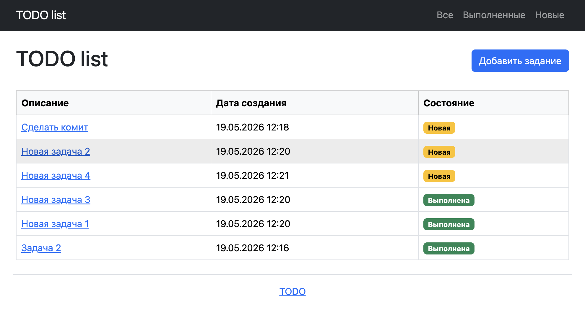
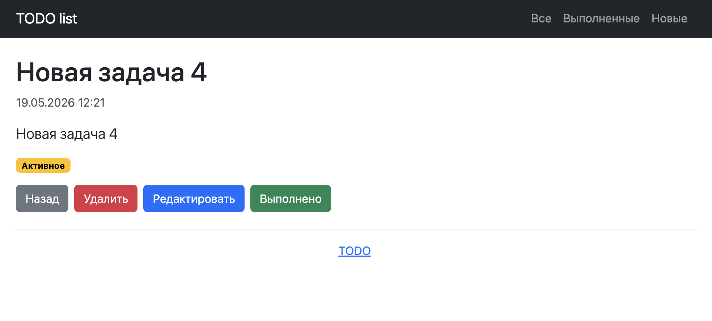
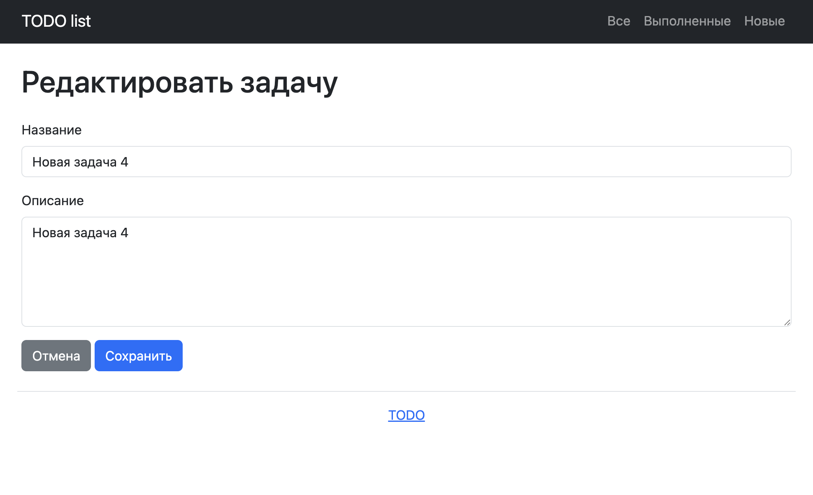

# Job4j TODO List

Приложение для управления списком задач.

## Стек технологий

- Java 21
- Spring Boot 3.5.14
- Thymeleaf 3.1.5
- Bootstrap 5
- Hibernate 6.6.49
- PostgreSQL 42.7.11
- Liquibase 4.15.0
- Maven 3

## Требования к окружению

- JDK 21
- PostgreSQL 18+
- Maven 3.9+

## Возможности приложения

Просмотр всех задач, фильтрация по выполненным и новым задачам, добавление новой задачи, 
просмотр подробной информации, редактирование, отметка задачи как выполненной, удаление задачи.

## Архитектура

Приложение разделено на три слоя: контроллеры, сервисы и слой персистенции.
Объект SessionFactory создаётся один раз через Spring Context и используется в слое персистенции через конструктор.

## База данных

В проекте используется таблица tasks с полями id, description, created и done.
Миграции базы данных выполняются через Liquibase.

## Запуск проекта

1. Создать базу данных PostgreSQL.
2. Настроить подключение к базе данных.
3. Запустить приложение через Maven.
4. Открыть приложение в браузере.

## Страницы приложения

- Главная страница содержит список задач, кнопки фильтрации и кнопку добавления новой задачи.
- Страница подробного описания задачи содержит информацию о задаче и действия: выполнить, редактировать, удалить.
- Страница редактирования позволяет изменить описание задачи.

## Скриншоты

### Список задач

### Подробная информация о задаче

### Редактирование задачи

